# Cosmos Auto Multiview: 以 Waymo 后训练理解 Cosmos 组件

::: info 核心资料
- **官方训练文档**: [Auto Multiview Post-training with Waymo Dataset](https://docs.nvidia.com/cosmos/latest/predict2.5/post-training/multiview.html)
- **模型矩阵**: [Cosmos-Predict2.5 Model Matrix](https://docs.nvidia.com/cosmos/latest/predict2.5/model_matrix.html)
- **推理参考**: [Cosmos-Predict2.5 Model Reference](https://docs.nvidia.com/cosmos/latest/predict2.5/reference.html)
- **代码仓库**: [nvidia-cosmos/cosmos-predict2.5](https://github.com/nvidia-cosmos/cosmos-predict2.5)
:::

这页笔记把 Auto Multiview 当成一个 Cosmos 案例来读：它不只是"如何跑 Waymo 后训练"，而是把 **数据工程、conditioner、tokenizer/VAE、rectified-flow trainer、multiview DiT、context parallel、checkpoint 与推理验证** 串成一条可追踪的代码链。

---

## Part A: 全局认知

### A.1 这条任务线训练什么

Auto Multiview 属于 `Cosmos-Predict2.5-2B/auto/multiview`。官方模型矩阵把它定位为 driving 场景的 7-camera view 模型，输入接口仍继承 Predict2.5 的 Text/Image/Video 条件范式。也就是说，它不是普通单视角 Video2World，而是学习同一个驾驶世界在多路相机中的同步呈现。

官方 Waymo 后训练示例实际使用 Waymo Open Dataset 的 5 路相机：

- `pinhole_front`
- `pinhole_front_right`
- `pinhole_side_right`
- `pinhole_side_left`
- `pinhole_front_left`

代码中仍保留 7-camera checkpoint 的 view id 槽位：`front=0`、`front_right=1`、`side_right=2`、跳过 `back=3`、`side_left=4`、`front_left=5`、跳过 `front_tele=6`。这个细节很重要：**模型不是只看到 5 个普通视频，而是知道这些视频在 7-view 环视模板中的语义位置**。

从世界模型角度，任务可以写成：

$$
p_\theta(x^{1:V}_{t+1:t+T} \mid x^{1:V}_{1:t}, c)
$$

其中 $V$ 是视角数，$c$ 是 caption 与视角前缀等条件。训练目标不是让某一路视频单独清晰，而是让车道线、车辆、行人、道路结构、自车运动在多个相机中保持时空一致。

### A.2 Cosmos 组件地图

Auto Multiview 涉及的 Cosmos 组件可以按数据流理解：

```mermaid
flowchart LR
  A["Waymo 多相机 TFRecord"] --> B["download_waymo.sh / convert_waymo.py"]
  B --> C["input/<sample_id>/*.mp4 + caption.jsonl"]
  C --> D["WaymoLocalDataset"]
  D --> E["ExtractFramesAndCaptions"]
  E --> F["MultiViewConditioner"]
  F --> G["MultiviewVid2VidModelRectifiedFlow"]
  G --> H["Video tokenizer / latent"]
  H --> I["MultiViewDiT"]
  I --> J["Rectified-flow loss"]
  J --> K["DCP checkpoint"]
  K --> L["convert_distcp_to_pt.py"]
  L --> M["examples/multiview.py"]
```



对应到真实代码：

| 环节 | 代码入口 | 在 Cosmos 中的角色 |
|---|---|---|
| 模型注册 | `cosmos_predict2/config.py` | `ModelVariant.AUTO_MULTIVIEW` 绑定官方 checkpoint |
| 配置入口 | `cosmos_predict2/_src/predict2_multiview/configs/vid2vid/config.py` | 在 Video2World 基础配置上注册 multiview 专用组件 |
| Waymo 实验 | `cosmos_predict2/experiments/multiview/waymo.py` | 指定 checkpoint、Waymo dataloader、8 路 context parallel、训练步数 |
| 本地数据集 | `datasets/local.py` | 从 sample 目录读取多路 MP4 和 `caption.jsonl` |
| 多视角增强 | `datasets/multiview.py` | 抽帧、拼接视角、生成 `view_indices`、组织 batch |
| 条件系统 | `defaults/conditioner.py` | 生成条件帧 mask、文本条件、视角索引条件 |
| 模型封装 | `models/multiview_vid2vid_model_rectified_flow.py` | 继承 Video2World rectified-flow 训练/采样逻辑 |
| 主干网络 | `networks/multiview_dit.py` | DiT 主干，加入 view embedding 和多相机位置编码 |
| 跨视角主干 | `networks/multiview_cross_dit.py` | 可选 cross-view attention 版本 |

从这个表可以看出，Auto Multiview 没有重写整个 Cosmos。它复用 Predict2.5 的 Video2World 框架，只在 **数据组织、条件表达、视角位置编码、多视角前向形状处理** 上做专门扩展。

### A.3 Auto Multiview 如何帮助理解 Cosmos 其他组件

Auto Multiview 是学习 Cosmos 的好案例，但更准确地说，它不是把所有 Cosmos 产品都直接跑了一遍，而是把 **Cosmos 的平台分层** 暴露得很清楚：哪些组件真正进入了 Waymo 后训练主链，哪些组件虽然没有在当前脚本里直接调用，却能通过这条任务线帮助我们理解整个 Cosmos 的设计方法。

先看这条任务里 **直接使用** 的组件：

| Cosmos 组件 | 在当前 Waymo Auto Multiview 任务中的真实用法 |
|---|---|
| Predict2.5 | 作为底座提供统一的 Video2World + rectified-flow 框架。`predict2_multiview/config.py` 先调用 base `vid2vid_make_config()`，再注册 multiview 专用组件，说明这是在 Predict2.5 主框架上的特化分支 |
| Reason/Text encoder | 直接参与训练。实验配置把 `text_encoder_class` 设为 `reason1p1_7B`，并在线计算文本 embedding；Waymo 默认只用前视 caption，再拼接不同相机的 view prefix 作为 cross-attention 条件 |
| Video tokenizer/VAE | 直接复用 Predict2.5 的 latent 接口。`MultiviewVid2VidModelRectifiedFlow.encode()/decode()` 会先把 `[B, C, V*T, H, W]` reshape 成 `[(B*V), C, T, H, W]` 送入父类 tokenizer，再拼回多视角形状 |
| MultiViewConditioner | 是多视角任务的条件接口。它把文本条件、`view_indices_B_T`、`ref_cam_view_idx_sample_position` 和条件帧 mask 统一组织成 `MultiViewCondition` |
| MultiViewDiT | 是多视角建模的核心特化。它保持 `[V*T]` 的长序列接口，但通过 `view embedding`、`MultiCameraVideoRopePosition3DEmb` 和多视角 cross-attention，让模型知道每个 token 属于哪个 camera slot |
| Context parallel | 直接用于训练和推理。Waymo experiment 把 `context_parallel_size` 设为 8，多视角长序列依赖 CP 才能在大模型上落地 |
| DCP checkpoint | 训练默认保存 distributed checkpoint，之后再用 `convert_distcp_to_pt.py` 转成推理使用的 `.pt` 权重 |

从代码链上看，实际主流程是：

1. `Waymo TFRecord -> convert_waymo.py -> input/<sample_id>/*.mp4 + caption.jsonl`
2. `WaymoLocalDataset` 读取样本目录。
3. `ExtractFramesAndCaptions` 对 5 路相机抽取同一组 `frame_indices`，拼成 `video: [C, V*T, H, W]`，并生成 `view_indices`。
4. `MultiViewConditioner` 根据文本、view id 和条件帧策略生成 `condition_video_input_mask`。
5. `MultiviewVid2VidModelRectifiedFlow` 复用 Predict2.5 的 rectified-flow 训练逻辑，在 latent 空间上学习多视角未来世界。
6. `MultiViewDiT` 在共享主干上注入视角语义，保证多相机的一致建模。

这条链最值得学习的地方在于：**Auto Multiview 没有重写整个 Cosmos，而是只在数据组织、条件表达、视角位置编码和多视角前向形状处理上做最小必要扩展。**

再看那些 **当前任务里没有直接进入训练热路径，但能通过这个案例帮助理解的 Cosmos 组件**：

| Cosmos 组件 | 为什么 Auto Multiview 能帮助理解它 |
|---|---|
| Curator 思路 | Waymo 训练前必须先下载、筛样本、对齐多相机时间、转换格式，说明 Cosmos 对数据工厂的依赖非常强。这里体现的是 Curator 的方法论，而不是训练脚本里直接 import `cosmos-curator` |
| Transfer2.5 思路 | 当前页面是 Predict2.5 的 multiview 后训练，但同一套多视角数据组织方式，后续可以继续送进 depth/seg/edge/HD map 控制生成任务，帮助理解 Transfer2.5 如何复用世界模型底座 |
| Evaluator / Guardrail | 当前配方没有把 evaluator/guardrail 作为训练内联模块，但 multiview 任务天然提醒我们：评估不能只看单路视频清晰度，还必须看跨视角几何与物理一致性 |

如果把它放进自动驾驶合成数据闭环中，可以理解为：

1. Curator / Dataset Search 找到高质量或长尾驾驶片段。
2. Predict2.5 Auto Multiview 学习或生成多视角未来世界。
3. Transfer2.5 在 depth/seg/edge/HD map 等控制下改变天气、光照、地域或传感器域。
4. Evaluator / Guardrail 检查视觉质量、物理合理性和安全风险。
5. 下游 BEV、occupancy、预测、规划模型用合成数据做 ablation。

因此，Auto Multiview 对理解 Cosmos 的价值，不在于“它调用了所有组件”，而在于它清楚展示了 Cosmos 的共性抽象：

- 上层任务差异来自数据和条件定义；
- 中层接口由 conditioner 统一管理文本、条件帧和结构化元信息；
- 下层骨架则复用 Predict2.5 的 tokenizer、rectified flow、DiT、context parallel 和 checkpoint 工程。

这也是 Cosmos 与普通视频生成模型的关键差异：目标不是生成一条漂亮视频，而是构建可后训练、可条件控制、可评估、能服务下游 Physical AI 的世界数据基础设施。
---

## Part B: 数据管线

### B.1 数据准备：从 Waymo 到训练样本

官方命令：

```bash
gcloud init
bash scripts/download_waymo.sh datasets/multiview/waymo/ <number_of_files>
uv pip install waymo-open-dataset-tf-2-11-0==1.6.1
python scripts/convert_waymo.py --num_workers 8
```

`scripts/convert_waymo.py` 的核心工作是：

1. 读取 Waymo TFRecord 中每一帧的 camera JPEG。
2. 按 5 路相机缓存图像序列。
3. 以 Waymo 原始 10Hz 写成 `pinhole_<camera>.mp4`。
4. 从 `waymo_caption.csv` 取 caption，只写给 `pinhole_front`。
5. 生成每个 sample 的 `caption.jsonl`。

转换后的样本目录：

```text
datasets/multiview/waymo/input/<sample_id>/
├── pinhole_front.mp4
├── pinhole_front_left.mp4
├── pinhole_front_right.mp4
├── pinhole_side_left.mp4
├── pinhole_side_right.mp4
└── caption.jsonl
```

这里有一个容易忽略的设计：`caption.jsonl` 并不是每个视角都必须有独立语义。Waymo 示例只使用前视 caption，再由 dataloader 给不同相机加视角前缀。这样做的原因是驾驶场景的高层语义通常是全局共享的，而相机方向由 view prefix 和 view id 负责表达。

#### TFRecord 内部结构与 Waymo 5 相机映射

Waymo Open Dataset 以 `TFRecord` 格式发布，每个 `.tfrecord` 封装一个约 20 秒的驾驶片段。内部由 Protobuf 定义，核心 message 为 `Frame`：

```protobuf
message Frame {
  uint64 timestamp_micros = 1;
  repeated CameraImage images = 2;
  repeated CameraCalibration camera_calibrations = 3;
  repeated Laser laser_labels = 4;
  map<string, bytes> context = 5;
}
```

字段含义：

| 字段 | 内容 | Cosmos 使用情况 |
|------|------|---------------|
| `images` | 每路相机 JPEG 编码图像 + 曝光/快门元数据 | **使用** -- 提取 JPEG 像素写 MP4 |
| `camera_calibrations` | 内参（焦距、主点、畸变）+ 外参（相对车体 RT） | 未直接使用（Cosmos 训练仅依赖 2D 像素） |
| `laser_labels` | 激光雷达点云 + 3D 标注框 + 物体速度/加速度 | 未使用 -- 仅图像信号驱动 |
| `context` | 天气、时间、城市场景元信息 | 未使用 -- caption 由 `waymo_caption.csv` 独立提供 |

`convert_waymo.py` 的解析逻辑：

```python
from waymo_open_dataset import dataset_pb2

frame = dataset_pb2.Frame()
frame.ParseFromString(tf_record_bytes)

for camera_name in CameraNames:  # ["front","front_left","front_right","side_left","side_right"]
    cam_enum = dataset_pb2.CameraName.Name.Value(camera_name.upper())
    for img in frame.images:
        if img.name == cam_enum:
            jpeg_bytes = img.image   # 原始 JPEG，直接写 MP4
```

转换脚本只读取 JPEG 字节而忽略 LiDAR 和标注，因此训练时仅依赖纯图像信号--这恰好对齐 Cosmos 不依赖 3D 标注的视频世界模型训练范式。

Waymo 相机名 (`FRONT`, `FRONT_LEFT`, `FRONT_RIGHT`, `SIDE_LEFT`, `SIDE_RIGHT`) 通过枚举值映射到 Cosmos 内部 view ID：

| Waymo 相机 | MP4 文件名 | Cosmos view ID | 备注 |
|-----------|-----------|---------------|------|
| `FRONT` | `pinhole_front.mp4` | 0 | 前视主相机 |
| `FRONT_LEFT` | `pinhole_front_left.mp4` | 1 | 左前方斜向 |
| `FRONT_RIGHT` | `pinhole_front_right.mp4` | 2 | 右前方斜向 |
| `SIDE_LEFT` | `pinhole_side_left.mp4` | 4 | 左侧方 |
| `SIDE_RIGHT` | `pinhole_side_right.mp4` | 5 | 右侧方 |
| *(空缺)* | -- | 3 | `BACK` 槽位，Waymo 5 相机未覆盖 |
| *(空缺)* | -- | 6 | `FRONT_TELE` 槽位，Waymo 5 相机未覆盖 |

view ID 不连续的原因：Auto Multiview 预训练使用 7-camera 体系，训练和推理时 `n_cameras_emb=7` 固定。Waymo 后训练填充其中 5 个槽位，缺失的 view 3 和 view 6 保持为未使用的 embedding 位置。

> **交叉引用**: 完整 Waymo 传感器配置、版本演进、Cosmos 生态互连见 [Waymo Open Dataset](/video-generation/datasets/waymo)。

### B.2 Dataloader 如何把 5 路视频变成一个 batch

配置入口是 `register_waymo_dataloader()`。它指定 720p、29 帧、batch size 1，并把 5 个相机名映射到视频键、caption 键和 view id。

可以把 dataloader 的伪代码理解为：

```python
for camera in camera_order:
    caption = shared_front_caption + camera_prefix
    frames = decode_mp4(camera_video, same_frame_indices)
    all_views.append(frames)
    view_ids.extend(camera_view_id repeated per frame)

video = concatenate_views_as_temporal_axis(all_views)
sample = {
    "video": video,                  # B 后续 collate；单样本是 C, V*T, H, W
    "ai_caption": captions,          # 每个 view 一条或共享 caption
    "view_indices": view_ids,        # 长度 V*T
    "num_video_frames_per_view": T,
    "sample_n_views": V,
}
```

真实代码里，`ExtractFramesAndCaptions` 会检查所有视角使用同一个 `frame_indices` 和相同 FPS。这是多视角训练的底线：如果各路相机时间没有对齐，模型看到的就不是同一世界状态，而是错位的相机序列。

输出张量的关键形状是：

$$
\text{video}: [C,\; V \times T,\; H,\; W]
$$

也就是说，Cosmos 在数据层先把多视角合并进时间轴，形成一个长序列。但它没有丢掉 view 信息，因为 `view_indices` 会跟着每个 latent timestep 进入 conditioner 和 DiT。

### B.3 为什么把多视角拼到时间轴

把 `[V, T]` 展成 `[V*T]` 有两个工程好处：

1. 复用 Video2World 的 tokenizer、conditioner、trainer 和 DiT 时序接口，不需要为多视角单独发明一套训练框架。
2. 让 context parallel 继续沿序列维切分，只是切分对象从单视频时间序列变成多视角时空序列。

但如果只拼接而不告诉模型 view id，模型会把 `front_right` 和 `side_left` 当成普通时间片，产生严重歧义。所以 Auto Multiview 同时引入：

- `view_indices`: 每个 latent token 属于哪个相机槽位；
- `camera_prefix_mapping`: 文本层告诉模型相机朝向；
- `MultiCameraVideoRopePosition3DEmb`: 位置编码层按相机重复时间位置；
- `view_embeddings`: 通道层给不同视角注入可学习 embedding。

这就是 Auto Multiview 的核心：**形状上复用视频序列，语义上保留相机视角**。
---

## Part C: 条件系统

### C.1 Conditioner：决定哪些帧是条件，哪些帧要生成

`MultiViewCondition` 继承普通 `Video2WorldCondition`，新增了三个关键字段：

- `state_t`: 每个 view 在 latent 空间中的时间长度；
- `view_indices_B_T`: 每个 latent timestep 的相机 id；
- `ref_cam_view_idx_sample_position`: 推理或训练时参考相机的位置。

它的核心方法是 `set_video_condition()`。这个方法不直接生成视频，而是生成一个 mask：

$$
\text{condition\_video\_input\_mask}: [B, 1, V \times T, H, W]
$$

mask 为 1 的位置表示"作为条件输入给模型看"，mask 为 0 的位置表示"需要模型预测/生成"。Auto Multiview 支持几种条件位置：

| 条件模式 | 含义 | 典型用途 |
|---|---|---|
| `NO_CAM` | 不使用相机视频条件 | Text2World |
| `REF_CAM` | 使用参考相机整路视频作为条件 | 单视角到多视角 |
| `ANY_CAM` | 随机选择一路相机作为条件 | 任意视角补全多视角 |
| `FIRST_RANDOM_N` | 每个 view 使用前 N 帧作为条件 | Video2World 续写 |

在 Video2World 后训练中，最直观的是 `FIRST_RANDOM_N`：模型看到每个相机的前 1-2 帧 latent，学习预测后续 latent。它对应世界模型里的"给定历史观测，预测未来状态"。

---

## Part D: 模型架构

### D.1 模型封装：MultiviewVid2VidModelRectifiedFlow

官方实现的入口不是单个文件，而是 4 层注册链：

1. `cosmos_predict2/_src/predict2_multiview/configs/vid2vid/config.py`
2. `defaults/model.py` 把 `fsdp_rectified_flow_multiview` 绑定到 `MultiviewVid2VidModelRectifiedFlow`
3. `defaults/net.py` 注册 `cosmos_v1_2B_multiview`
4. `experiments/multiview/waymo.py` 只覆盖数据集、checkpoint 和 `context_parallel_size=8`

也就是说，Waymo 不是重新写一套模型，而是在通用 `Predict2.5 multiview` 骨架上做后训练。真正的模型类定义在 `cosmos_predict2/_src/predict2_multiview/models/multiview_vid2vid_model_rectified_flow.py`。

这个类依然继承 `Video2WorldModelRectifiedFlow`，所以 rectified-flow 主流程没有变：

1. tokenizer 先把像素视频编码成 latent；
2. 在 `x_0` 和高斯噪声之间做插值；
3. DiT 预测 latent 空间的 velocity；
4. 采样时再把 velocity 场积分回视频 latent；
5. 最后 decode 成多视角视频。

多视角版本新增的实现点主要有 4 个。

**D.1.1 `encode()` / `decode()` 先按 view 重排，再决定是否走 CP**

源码里的第一步不是直接喂给父类，而是先把

```python
[B, C, V*T, H, W]
```

重排成

```python
[(B*V), C, T, H, W]
```

然后复用单视角 `super().encode()` / `super().decode()`。对应代码是：

- `encode()` 中的 `rearrange(state, "B C (V T) H W -> (B V) C T H W", V=n_views)`
- `decode()` 中的反向 `rearrange`

如果 `n_views > 1 and n_views <= cp_size`，它不会走普通路径，而是进入 `encode_cp()` / `decode_cp()`：

- 先把每个 view 拆成 `V B C T H W`
- 用 `broadcast_split_tensor(..., seq_dim=0)` 把不同 view 分发到 context parallel rank
- 每个 rank 本地 encode / decode
- 再用 `dist.all_gather` 拼回完整多视角 latent

所以这里的 `context_parallel_size=8` 不只是 DiT attention 的并行，也参与 tokenizer 侧的多视角 encode/decode。

**D.1.2 `get_data_batch_with_latent_view_indices()` 把像素级 view id 对齐到 latent 时间轴**

Waymo dataloader 输出的是像素帧级别的：

- `view_indices`: `[B, V * num_video_frames_per_view]`
- `num_video_frames_per_view`: Waymo 本地配置里是 29

但 DiT 看到的不是 29 个像素帧，而是 tokenizer 压缩后的 `state_t` 个 latent 帧。于是模型先做：

```python
view_indices_B_V_T = rearrange(data_batch["view_indices"], "B (V T) -> B V T", V=n_views)
latent_view_indices_B_V_T = view_indices_B_V_T[:, :, 0:self.config.state_t]
latent_view_indices_B_T = rearrange(latent_view_indices_B_V_T, "B V T -> B (V T)")
```

这就是 `latent_view_indices_B_T` 的来源。它的作用很明确：后面 view embedding 和 condition mask 都要按 latent timestep 对齐，而不是按像素帧对齐。

**D.1.3 `get_data_and_condition()` 在 latent 空间构造多视角条件**

`get_data_and_condition()` 先调用父类拿到：

- `raw_state`
- `latent_state`
- `condition`

然后立刻把 `condition` 强制转成 `MultiViewCondition`，并调用：

```python
condition.set_video_condition(
    state_t=self.config.state_t,
    gt_frames=latent_state,
    condition_locations=self.config.condition_locations,
    ...
)
```

这里有两个关键点。

第一，条件是直接建在 `latent_state` 上的，不是在像素空间单独维护一份 mask。

第二，mask 形状先在 `MultiViewCondition.set_video_condition()` 里建成：

```python
[B, 1, V, T, H, W]
```

再重排成：

```python
[B, 1, V*T, H, W]
```

对应 `condition_video_input_mask_B_C_T_H_W`。后面 DiT 前向就是靠这个张量知道哪些 latent token 是已知条件。

**D.1.4 `MultiViewCondition` 真正实现了 4 种条件模式**

这部分实现在 `defaults/conditioner.py` 的 `MultiViewCondition.set_video_condition()`。它不是抽象概念，而是明确改写 mask：

| 模式 | 代码行为 | 典型用途 |
|---|---|---|
| `NO_CAM` | 不给任何视频条件 | Text2World |
| `REF_CAM` | `enable_ref_cam_condition()` 把某一路 view 的整段 mask 置 1 | 单视角补全多视角 |
| `ANY_CAM` | 从 `view_indices_B_T` 随机选一路 view 作为条件 | 任意视角补全 |
| `FIRST_RANDOM_N` | `enable_first_random_n_condition()` 把每路 view 的前 N 个 latent 帧置 1 | Video2World 续写 |

Waymo 后训练最关键的是 `FIRST_RANDOM_N`。在官方 multiview 基础实验 `buttercup2p5_rectified_flow.py` 里，默认就是：

```python
condition_locations=["first_random_n"]
conditional_frames_probs={0: 0.5, 1: 0.25, 2: 0.25}
```

这意味着模型经常要在“只看前 0/1/2 个 latent 帧”的情况下预测后续多视角世界状态。

### D.2 MultiViewDiT：实际模型结构

主干网络定义在 `cosmos_predict2/_src/predict2_multiview/networks/multiview_dit.py`，注册入口在 `defaults/net.py`。

需要区分两层配置。

第一层是网络注册表里的 `COSMOS_V1_2B_MULTIVIEW_NET`，给出 2B 结构基线：

| 参数 | 2B multiview 值 | 作用 |
|---|:---:|---|
| `in_channels` | 16 | 视频 tokenizer 的 latent channel |
| `out_channels` | 16 | 预测同维度 latent 输出 |
| `patch_spatial` | 2 | 空间 patch 化 |
| `patch_temporal` | 1 | latent 时间维不再额外 patch 合并 |
| `model_channels` | 2048 | Transformer hidden size |
| `num_blocks` | 28 | DiT block 数 |
| `num_heads` | 16 | attention head 数 |
| `pos_emb_cls` | `rope3d` | 三维时空 RoPE |
| `n_cameras_emb` | 7 | 7 个相机槽位 embedding |
| `view_condition_dim` | 6 | 每个 view 的可学习通道 embedding 维度 |
| `concat_view_embedding` | `True` | 把 view embedding 拼到 latent channel |

第二层是 multiview 基础实验 `buttercup2p5_rectified_flow.py` 里的覆盖项。官方真正训练 2B 7-view 模型时，又把下面这些参数显式改掉了：

- `state_t=8`
- `view_condition_dim=7`
- `timestep_scale=0.001`
- `use_crossattn_projection=True`
- `crossattn_proj_in_channels=100352`
- `crossattn_emb_channels=1024`

所以读代码时要有一个判断：`defaults/net.py` 给的是架构模板，具体实验还会继续 override。

`MultiViewDiT.forward()` 的执行可以按 5 步看。

**D.2.1 输入拼接 condition mask**

在 `forward()` 里，第一件事就是把条件 mask 直接拼到输入通道：

```python
if data_type == DataType.VIDEO:
    x_B_C_T_H_W = torch.cat(
        [x_B_C_T_H_W, condition_video_input_mask_B_C_T_H_W.type_as(x_B_C_T_H_W)],
        dim=1,
    )
```

这说明 Cosmos 不是把条件帧单独塞进 loss，而是把“哪些 token 已知”也作为网络输入的一部分。对 multiview 来说，这个设计尤其重要，因为不同相机、不同时间位置的条件帧并不总是对齐的。

**D.2.2 注入 view embedding**

这部分在 `prepare_embedded_sequence()` 里完成。逻辑是：

1. 先根据当前张量长度和 `state_t` 反推出 `n_cameras`
2. 用 `view_indices_B_T` 查 `self.view_embeddings`
3. 把结果从 `[B, V*T, D]` 重排成 `[B, D, V, T, 1, 1]`
4. expand 到整张 feature map
5. 和 latent channel 做 `torch.cat`

核心代码是：

```python
view_embedding = self.view_embeddings(view_indices_B_T)
view_embedding = rearrange(view_embedding, "B (V T) D -> B D V T", V=n_cameras)
x_B_C_V_T_H_W = rearrange(x_B_C_T_H_W, "B C (V T) H W -> B C V T H W", V=n_cameras)
x_B_C_V_T_H_W = torch.cat([x_B_C_V_T_H_W, view_embedding], dim=1)
```

这一步的作用不是“给不同视角不同语义标签”这么简单，而是强制网络知道当前 token 属于哪一路物理相机槽位。由于 Waymo dataloader 里用的是 7-camera 体系下的稀疏编号：

- `front -> 0`
- `front_right -> 1`
- `side_right -> 2`
- `side_left -> 4`
- `front_left -> 5`

所以模型即使只训练 5 路，也仍然保留了对 7 个 canonical camera slot 的认知。

**D.2.3 多相机 RoPE 位置编码**

这部分不只是“用了 RoPE”，而是专门写了 `MultiCameraVideoRopePosition3DEmb`。

`build_pos_embed()` 会为 `1..n_cameras_emb` 的每个可能相机数都预构造一个 position embedder：

```python
for n_cameras in range(1, self.n_cameras_emb + 1):
    pos_embedder, extra_pos_embedder = self.build_pos_embed_for_n_cameras(n_cameras)
```

真正生成 embedding 时，`generate_embeddings()` 先把总长度 `T` 除以 `self.n_cameras`，得到单相机时间长度，再对每个 camera 单独调用父类 `VideoRopePosition3DEmb.generate_embeddings()`，最后再拼起来。

这和普通单视频 DiT 的根本区别是：

- 普通视频：`T` 表示一条时间轴
- multiview：外表上也是长度 `V*T`，但语义上是 `V` 段并列的小时间轴

如果不这么做，第二个相机的第 1 帧会被编码成“第一个相机的第 `T+1` 帧”，时间语义完全错位。

另外，`_split_for_context_parallel()` 还会把 embedding 重排成按 view 分块的格式，再做 CP 切分，保证并行切块不会破坏 camera 内部的时间结构。

**D.2.4 Multiview block 中的 attention**

`MultiViewBlock` 继承普通 `Block`，但会删除原来的 `cross_attn`，替换成 `MultiViewCrossAttention`。

这个 attention 的关键不是新 attention 公式，而是新的重排方式：

```python
n_cameras = context.shape[1] // 512
x_B_L_D = rearrange(x, "B (V L) D -> (V B) L D", V=n_cameras)
context_B_M_D = rearrange(context, "B (V M) D -> (V B) M D", V=n_cameras)
x_B_L_D = super().forward(x_B_L_D, context_B_M_D, rope_emb=rope_emb)
```

也就是说，文本条件在进入 cross-attention 前，会先按 view 拆开，然后让每一路 camera token 主要 attend 到对应那一路 view 的文本片段。

这和 Waymo dataloader 的设计正好对应：`dataloader_local.py` 默认对不同 camera 加了方向前缀，例如：

- forward
- front right
- side right
- side left
- front left

所以文本 cross-attention 学到的不是泛泛的驾驶 caption，而是“这个方向上的场景描述”。

补充一点：`defaults/net.py` 里还注册了 `MultiViewCrossDiT`。那一版会打开 `enable_cross_view_attn=True`，显式建模跨视角 token 交互；但 Waymo 默认后训练实验继承的是 `cosmos_v1_2B_multiview`，不是 crossview 变体。

**D.2.5 输出回 latent patch**

经过 28 个 `MultiViewBlock` 之后，网络执行：

```python
x_B_T_H_W_O = self.final_layer(...)
x_B_C_Tt_Hp_Wp = self.unpatchify(x_B_T_H_W_O)
```

输出依然是与输入 latent 同形状的张量：

```python
[B, C, V*T, H, W]
```

但它的语义不是像素，也不是直接的 `x_0`，而是 rectified-flow 目标下的 velocity prediction。

### D.3 Rectified Flow 在这里做什么

这部分最好直接看 `training_step_multiview()`，因为官方实现写得很直白。

训练时先得到真实 latent：

```python
_, x0_B_C_T_H_W, condition = model.get_data_and_condition(data_batch)
```

然后采样噪声和连续时间：

```python
epsilon_B_C_T_H_W = torch.randn(...)
t_B = model.rectified_flow.sample_train_time(batch_size)
```

接着通过 rectified-flow 的插值公式构造中间状态 `x_t` 和目标 velocity `v_t`：

```python
xt_B_C_T_H_W, vt_B_C_T_H_W = model.rectified_flow.get_interpolation(
    epsilon_B_C_T_H_W, x0_B_C_T_H_W, sigmas
)
```

随后 DiT 预测 velocity：

```python
vt_pred_B_C_T_H_W = model.denoise(
    noise=epsilon_B_C_T_H_W,
    xt_B_C_T_H_W=xt_B_C_T_H_W,
    timesteps_B_T=timesteps,
    condition=condition,
)
```

最后 loss 就是 time-weighted MSE：

```python
per_instance_loss = mean((vt_pred - vt) ** 2)
loss = mean(time_weights * per_instance_loss)
```

所以从代码实现上看，Auto Multiview 并没有发明新的 flow objective。它改的是 `x_0` 的组织方式和 `condition` 的组织方式：

- `x_0` 不再是一条单视角 latent 序列，而是 `V` 路相机拼接后的联合 latent
- `condition` 除了文本，还带 `view_indices_B_T` 和 `condition_video_input_mask_B_C_T_H_W`

因此模型学到的不是“五个单相机模型并排训练”，而是一个真正联合建模多视角时空分布的 rectified-flow world model。
---

## Part E: 训练

### E.1 `waymo.py` 实验文件是最终配置

`cosmos_predict2/experiments/multiview/waymo.py` 是 Waymo 后训练的完整入口。关键配置：

| 参数 | 值 | 含义 |
|---|---|---|
| `checkpoint` | `Cosmos-Predict2.5-2B-auto-multiview` | 从官方 checkpoint 启动 |
| `dataset` | `WaymoLocalDataset` | 从 `input/` 目录读取 |
| `context_parallel_size` | 8 | 模型跨 8 GPU/rank |
| `batch_size` | 1 | 每个 rank 单 sample |
| `sample_n_condition_frames` | -1 | 条件帧数让 conditioner 决定 |
| `pixel_space_condition` | `False` | 条件在 latent 空间 |
| `gradient_clip_val` | 1.0 | DiT 梯度裁剪 |
| `n_steps` | 100,000 | 总训练步数 |

训练循环与 Predict2.5 一致：

```python
# 1. 加载 data batch（多视角视频 + caption + view_indices）
data = next(iter(dataloader))

# 2. encode 到 latent (可能沿 context parallel 分布)
latent = model.encode(data.video)
latent_view_indices = model.get_latent_view_indices(data.view_indices)

# 3. 构建条件（latent-level mask）
condition = model.get_data_and_condition(data, latent, latent_view_indices)

# 4. rectified-flow loss
loss = model.compute_loss(latent, condition)

# 5. 梯度回传
loss.backward()
optimizer.step()
```

### E.2 Context Parallel 为什么是 8

Waymo 只有 5 路相机，但 `context_parallel_size=8`。原因：

1. 模型预训练在 7-camera checkpoint 上，参数里包含 7 个 view embedding。
2. $V \times T$ 序列很长，需要沿序列维切分以降低显存。
3. 8 GPU 是一个便于整除和负载均衡的数字（比 7 更接近 2 的幂）。
4. 一个 rank 处理某一段 latent sequence，所有 rank 同时做 attention 的通信聚合。

Cosmos 的 context parallel 不是把不同 view 分到不同 rank，而是把整个 $V \times T$ 序列沿时间/序列维切块。由此每个 rank 上可能同时包含来自多个 view 的 latent 段。这要求 DiT 在计算 attention 时做 ring attention 或等效通信，来让每个 token 能 attend 到全部其他 token。

如果把它拆得更细一点，可以把 CP 理解成发生在两个层面：

1. **tokenizer / VAE 层**：`encode()` / `decode()` 会先把张量重排成按 view 分组的形式；当 `n_views > 1 and n_views <= cp_size` 时，会走 `encode_cp()` / `decode_cp()`，先把不同 view 广播/切分到多个 CP rank，本地完成编码或解码，再 `all_gather` 回完整多视角结果。也就是说，CP 在 tokenizer 侧首先承担的是“把多路相机的编解码工作分摊到多卡”。
2. **DiT 主干层**：进入 latent transformer 以后，真正贵的是长序列 self-attention。此时多视角 latent 会被组织成统一的时空 token 序列，再沿 sequence 维做 CP 切分。这里切的不是“camera 1 给 rank 1、camera 2 给 rank 2”这种静态分工，而是把一整条 $V \times T$ token 流切成多个连续段。

这也是为什么它更接近 **sequence parallel**，而不是简单的 **view parallel**：

- 如果只按 view 切，5 路相机最多天然切成 5 份，既不适配 7-camera 预训练结构，也不利于在 8 卡机器上做均衡。
- 更关键的是，显存瓶颈主要来自长上下文 attention，而不是“相机路数”本身。即使一张卡只拿一两个 view，只要每个 view 的时间长度仍然很长，attention 开销还是下不来。
- 多视角任务需要跨 view 建模几何一致性。如果做成彼此隔离的纯 view parallel，就必须额外设计很重的跨卡交互；而沿统一序列切块后，可以直接复用 Cosmos 已有的 ring attention / CP 通信路径。

可以把一次前向近似想成下面这样：

```text
5 views x T frames
-> tokenizer encode_cp 在多卡上分摊多视角编解码
-> latent 按 [view_1 time..., view_2 time..., ..., view_5 time...] 组织
-> 再把整条长序列切成 8 段分给 8 个 CP ranks
-> 每个 rank 本地算自己那一段的 QKV / MLP
-> attention 通过 ring communication 看到全局上下文
-> all_gather 或等效聚合后进入后续层
```

因此，`context_parallel_size=8` 不是在表达“Waymo 有 8 个 camera”，而是在表达一套工程折中：

- **下界约束**：它至少要不小于当前多视角 tokenizer 路径需要处理的 view 数，否则 `encode_cp()` / `decode_cp()` 这条分摊路径不成立。
- **上界收益**：它越大，单卡承担的序列段越短，attention 激活和显存压力越小。
- **工程现实**：8 卡是训练集群里非常常见的拓扑，通信实现、负载均衡和 checkpoint 切分也都更顺手。

所以在 Auto Multiview 里，`5 views` 和 `8-way context parallel` 描述的是两件不同的事：

- `5 views` 是数据语义，表示一次样本里有 5 路相机观测。
- `8-way CP` 是并行策略，表示这份多视角时空上下文要被 8 个 rank 协同处理。

---

## Part F: Checkpoint 与推理准备

### F.1 DCP 格式与分布式训练

`cosmos_predict2.experiments.multiview.waymo.CHECKPOINT` 在 `config.py` 中映射为 `ModelVariant.AUTO_MULTIVIEW` 的 DCP checkpoint。训练过程中按 `every_n_steps` 写入 DCP（distributed checkpoint）。

DCP 管理复杂但很重要：

- 每张 GPU 写入自己的分片 + metadata。
- `n_gpus` 和 `context_parallel_size` 编码在 checkpoint 中。
- 不同 rank 数的 checkpoint 不能直接跨卡加载。

因此 Cosmos 提供 `convert_distcp_to_pt.py`。

### F.2 `convert_distcp_to_pt.py`

```bash
bash scripts/convert_distcp_to_pt.sh \
    checkpoints/Cosmos-Predict2.5-2B-auto-multiview-waymo-step-100000 \
    --use_ema
```

它做的事是：把所有 DCP 分片读回来，合并 state_dict，存成单个 `.pt`。推理代码加载的就是这个 `.pt`，无需再启动分布式环境。

### F.3 `examples/multiview.py` 推理验证

推理流程：

1. 加载 checkpoint 到 `MultiviewVid2VidModelRectifiedFlow`。
2. 指定 `--input_dir`（包含前端或全向 MP4 和 `caption.jsonl`）。
3. 根据 `--condition_mode`（如 `ANY_CAM` 或 `REF_CAM`）构造 conditional mask。
4. 从噪声 latent 积分 `n_steps` 步。
5. decode latent 成多路 MP4。

关键参数：

| 参数 | 典型值 | 作用 |
|---|---|---|
| `num_input_frames` | 9 或 17 | 多少帧作为历史观测 |
| `num_generated_frames` | 17 | 自回归生成或一次生成长度 |
| `num_video_frames_per_view` | 29 | 每路相机总帧数，涵盖输入+生成 |
| `sample_n_views` | 5 | Waymo 5 相机 |
| `n_views` | 7 | 模型内部 7 相机槽位 |
| `n_cameras_emb` | 7 | 以上前两者的区别体现了"采样视角数 vs 模型容量" |
| `guidance_scale` | 3.0 | 分类器自由引导强度 |
| `num_steps` | 64 | ODE 积分步数，影响质量和速度 |
| `seed` | 0 | 随机种子 |

---

## Part G: 从 Auto Multiview 理解 Cosmos 全局模式

把整个训练链路拼起来，可以看到 Cosmos 平台的核心运作模式：

1. **Checkpoint 驱动**: 所有实验都从一个已有的 `ModelVariant` checkpoint 启动。这意味着模型矩阵承担知识基础的角色，后训练是继续扩展而非从零开始。
2. **Config 注册式**: 每个 model variant 通过 `config.py` 注册 API 终端。实验文件只需 `import` 对应 variant 即可获得 dataloader、model、tokenizer。
3. **DCP -> pt 转换**: 训练使用分布式 checkpoint（DCP），推理需要单文件 pt。分工清晰：分布式训练环境解耦于推理。
4. **Data factory 优先**: 在 Waymo 用例中，超过一半的代码和文档用于数据下载、转换、验证。`ExtractFramesAndCaptions` 的跨相机帧对齐逻辑往往是出错和 debug 最集中的地方。
5. **条件系统即抽象层**: `MultiViewCondition` 在 latent 空间统一处理 mask、view indices、caption，让 DiT 不需要直接知道数据是从 Waymo、nuScenes 还是自定义传感器来。添加新数据集的核心工作是把相机映射和帧对齐做好，其余几乎被配置和 conditioner 吸收。
6. **视角是 1st-class citizen**: 从数据层的 `view_indices`，到 condition 的 `view_indices_B_T`，再到网络的 `view_embeddings` 和多相机 RoPE，视角信息在整个 pipeline 中反复注入，确保模型始终知道"这段 token 对应哪个物理相机"。

---

## Part H: 待继续深入的点

- **Video tokenizer/VAE**: 具体使用了哪种 3D VAE 或 2D VAE（Continuous Causal Spatial/Dual Spatial），latent 压缩的时空比如何影响 multiview 的对齐。
- **CrossViewAttention**: `MultiViewCrossDiT` 与普通 `MultiViewDiT` 的区别，cross-view attention 如何建模跨相机重投影，以及为什么 Waymo 实验不默认使用。
- **View embedding 和 multi-camera RoPE 消融**: 目前文档没有给出不带 view embedding 的实验效果，需要阅读论文或精读代码才能确认这些设计的贡献。
- **Ray Conditioning**: 官方提到 Ray2 条件将支持按指定 ray 生成未来视，这里可能与 `ref_cam_view_idx_sample_position` 有关。
- **Explicit BEV 一致性**: 当前 multiview 训练不直接使用几何 BEV 表示，是否有隐式的 BEV/深度/3D 约束在 latent 中形成。
- **多智能体与跨场景**: 将不同 waymo 片段拼成跨场景 multiview 轨迹的可行性、NVIDIA Cosmos 的 HuggingFace Space 示例与再训练。

---

## Part I: 如果继续扩展到强化学习后训练

### I.1 先把边界说清楚: 官方 Auto Multiview 目前不是 RL

截至当前公开实现，`predict2_multiview_post_train_waymo` 这条路径本质上仍然是 **监督式 rectified-flow post-training**，不是 GRPO/PPO 一类的强化学习后训练。训练命令仍然走：

```bash
torchrun --nproc_per_node=8 -m scripts.train \
  --config=cosmos_predict2/_src/predict2_multiview/configs/vid2vid/config.py \
  -- \
  experiment=predict2_multiview_post_train_waymo
```

对应代码入口是：

- `scripts/train.py`: 转发到 `cosmos_oss.scripts.train.main()`
- `cosmos_predict2/_src/predict2_multiview/configs/vid2vid/config.py`: 注册 multiview 的 model/net/dataloader/callback
- `cosmos_predict2/experiments/multiview/waymo.py`: 选择 `ModelVariant.AUTO_MULTIVIEW` checkpoint 和 Waymo dataloader
- `cosmos_predict2/_src/predict2_multiview/models/multiview_vid2vid_model_rectified_flow.py`: 定义真正的训练步

也就是说，Cosmos 已经把 **多视角数据组织、condition 构造、采样、分布式训练、checkpoint 管理** 都搭好了；如果要做 RL，最合理的策略不是推倒重写，而是复用这条管线，把训练目标从监督回归改成 reward-driven optimization。

### I.2 现有训练步到底在优化什么

`training_step_multiview()` 的核心逻辑可以压缩成下面这条链：

```python
data_batch = preprocess_databatch(data_batch, model.config.train_sample_views_range)
model.inplace_compute_text_embeddings_online(data_batch)

_, x0, condition = model.get_data_and_condition(data_batch)
epsilon = torch.randn_like(x0)
t = model.rectified_flow.sample_train_time(batch_size)
xt, vt = model.rectified_flow.get_interpolation(epsilon, x0, sigmas)

vt_pred = model.denoise(
    noise=epsilon,
    xt_B_C_T_H_W=xt,
    timesteps_B_T=timesteps,
    condition=condition,
)

loss = mean(time_weights * mse(vt_pred, vt))
```

这里的优化目标是：给定多视角历史帧和文字条件，让网络在 latent 空间里预测正确的 velocity target `v_t`。这说明当前后训练依赖的学习信号仍然来自 teacher target，而不是 rollout 后的视频质量打分。

### I.3 如果要改成 RL, 最自然的接入点在哪里

最自然的改法，就是保留现有的：

1. `WaymoLocalDataset` / `register_waymo_dataloader()` 作为数据入口
2. `MultiViewCondition` 作为多视角条件抽象层
3. `generate_samples_from_batch()` 作为 rollout 采样器
4. `MultiviewVid2VidModelRectifiedFlow` 作为主 policy

然后把 `training_step_multiview()` 改成：

```python
sample -> decode -> reward -> advantage -> policy update
```

换句话说，真正要替换的是“损失函数和更新逻辑”，不是整个 multiview 框架。

### I.4 一版更接近真实工程的 RL 训练框架

下面这段伪代码，基本就是把 Cosmos 现有结构改造成 GRPO 风格后训练时应该有的骨架：

```python
def rl_training_step_multiview(model, ref_model, reward_fn, data_batch, beta=0.02, group_size=4):
    data_batch = preprocess_databatch(data_batch, model.config.train_sample_views_range)
    model.inplace_compute_text_embeddings_online(data_batch)

    rollouts = []
    for k in range(group_size):
        latent, logprob = sample_with_logprob(model, data_batch, seed=k)
        video = model.decode(latent)
        reward = reward_fn(video, data_batch)

        with torch.no_grad():
            ref_logprob = score_under_ref(ref_model, latent, data_batch)

        rollouts.append((logprob, ref_logprob, reward))

    logprob = torch.stack([x[0] for x in rollouts])
    ref_logprob = torch.stack([x[1] for x in rollouts])
    reward = torch.stack([x[2] for x in rollouts])

    adv = (reward - reward.mean()) / (reward.std() + 1e-6)
    pg_loss = -(adv * logprob).mean()
    kl_loss = (logprob - ref_logprob).mean()
    loss = pg_loss + beta * kl_loss
    return {"reward": reward.mean(), "kl": kl_loss}, loss
```

这段代码里，真正需要你在 Cosmos 现有实现上补的新能力主要有三个：

1. `sample_with_logprob()`
   现在的 `generate_samples_from_batch()` 能生成样本，但默认不返回用于 RL 更新的轨迹概率信息。要做 policy gradient，必须把采样过程的可学习概率或其代理形式暴露出来。

2. `reward_fn()`
   不能只看“单个视频美不美”，而要针对 multiview 任务定义奖励。

3. `score_under_ref()`
   需要一个冻结 reference policy，通常就是初始的 `AUTO_MULTIVIEW` checkpoint，用来提供 KL 约束，避免 RL 把原本稳定的多视角分布拉崩。

### I.5 在 Auto Multiview 里, reward 不能只做单视角美学分

这是和普通视频生成 RL 最大的不同点。对 `Cosmos Auto Multiview` 来说，奖励至少要覆盖三类目标：

1. **跨视角几何一致性**
   同一辆车、同一条车道线、同一个路口结构，应该在前视、前左、前右、侧视之间保持一致。

2. **时间连续性 / 物理平滑性**
   不能只让单帧更清晰，而要让运动、速度、遮挡变化在时间上合理。

3. **语义条件一致性**
   当前 dataloader 默认把 caption 主要绑在 `pinhole_front` 上，因此 reward 要额外防止“前视角很好，侧视角塌掉”的偏置。

如果奖励只优化前视质量，RL 很可能会把策略推向一个对 front camera 过拟合、但跨视角关系失真的方向。

### I.6 为什么我不建议一开始就做纯 RL

对这个任务，更稳的工程路线不是直接把监督损失删掉，而是先做混合目标：

```python
loss = lambda_rf * rf_mse_loss + lambda_rl * rl_loss + beta * kl_loss
```

原因是：

- multiview 任务的结构约束很强，探索空间比单视角视频生成更大
- 现有 rectified-flow 目标已经提供了稳定的局部几何和时序锚点
- RL 更适合补“监督目标没有直接表达的全局质量”，比如跨视角一致性、下游感知可用性、长程 rollout 稳定性

所以更合理的理解是：
**Auto Multiview 现有代码提供了一个高质量的监督后训练底座；RL 应该作为其上的第二层对齐，而不是替代第一层。**

::: tip 总结
把 Waymo 后训练当作一个线性故事读，Cosmos 的设计意图会变得清晰：它不是一个单纯的 DiT 训练框架，而是一个从数据筛选到多视角世界生成的完整平台。Auto Multiview 只是 Predict2.5 + 视角注入的特化分支，但它所体现的数据思维、条件抽象、序列并行工程和 checkpoint 管理，构成了 Cosmos 所有产品线的共同基因。
:::
