# Cosmos Auto Multiview: 以 Waymo 后训练理解 Cosmos 组件

::: info 核心资料
- **官方训练文档**: [Auto Multiview Post-training with Waymo Dataset](https://docs.nvidia.com/cosmos/latest/predict2.5/post-training/multiview.html)
- **模型矩阵**: [Cosmos-Predict2.5 Model Matrix](https://docs.nvidia.com/cosmos/latest/predict2.5/model_matrix.html)
- **推理参考**: [Cosmos-Predict2.5 Model Reference](https://docs.nvidia.com/cosmos/latest/predict2.5/reference.html)
- **代码仓库**: [nvidia-cosmos/cosmos-predict2.5](https://github.com/nvidia-cosmos/cosmos-predict2.5)
:::

这页笔记把 Auto Multiview 当成一个 Cosmos 案例来读：它不只是“如何跑 Waymo 后训练”，而是把 **数据工程、conditioner、tokenizer/VAE、rectified-flow trainer、multiview DiT、context parallel、checkpoint 与推理验证** 串成一条可追踪的代码链。

## 1. 这条任务线训练什么

Auto Multiview 属于 `Cosmos-Predict2.5-2B/auto/multiview`。官方模型矩阵把它定位为 driving 场景的 7-camera view 模型，输入接口仍继承 Predict2.5 的 Text/Image/Video 条件范式。也就是说，它不是普通单视角 Video2World，而是学习同一个驾驶世界在多路相机中的同步呈现。

官方 Waymo 后训练示例实际使用 Waymo Open Dataset 的 5 路相机：

- `pinhole_front`
- `pinhole_front_right`
- `pinhole_side_right`
- `pinhole_side_left`
- `pinhole_front_left`

代码中仍保留 7-camera checkpoint 的 view id 槽位：`front=0`、`front_right=1`、`side_right=2`、跳过 `back=3`、`side_left=4`、`front_left=5`、跳过 `front_tele=6`。这个细节很重要：**模型不是只看到 5 个普通视频，而是知道这些视频在 7-view 环视模板中的语义位置**。

从世界模型角度，任务可以写成：

$$
p_\theta(x^{1:V}_{t+1:t+T} \mid x^{1:V}_{1:t}, c)
$$

其中 $V$ 是视角数，$c$ 是 caption 与视角前缀等条件。训练目标不是让某一路视频单独清晰，而是让车道线、车辆、行人、道路结构、自车运动在多个相机中保持时空一致。

## 2. Cosmos 组件地图

Auto Multiview 涉及的 Cosmos 组件可以按数据流理解：

```mermaid
flowchart LR
  A["Waymo 多相机 TFRecord"] --> B["download_waymo.sh / convert_waymo.py"]
  B --> C["input/<sample_id>/*.mp4 + caption.jsonl"]
  C --> D["WaymoLocalDataset"]
  D --> E["ExtractFramesAndCaptions"]
  E --> F["MultiViewConditioner"]
  F --> G["MultiviewVid2VidModelRectifiedFlow"]
  G --> H["Video tokenizer / latent"]
  H --> I["MultiViewDiT"]
  I --> J["Rectified-flow loss"]
  J --> K["DCP checkpoint"]
  K --> L["convert_distcp_to_pt.py"]
  L --> M["examples/multiview.py"]
```



对应到真实代码：

| 环节 | 代码入口 | 在 Cosmos 中的角色 |
|---|---|---|
| 模型注册 | `cosmos_predict2/config.py` | `ModelVariant.AUTO_MULTIVIEW` 绑定官方 checkpoint |
| 配置入口 | `cosmos_predict2/_src/predict2_multiview/configs/vid2vid/config.py` | 在 Video2World 基础配置上注册 multiview 专用组件 |
| Waymo 实验 | `cosmos_predict2/experiments/multiview/waymo.py` | 指定 checkpoint、Waymo dataloader、8 路 context parallel、训练步数 |
| 本地数据集 | `datasets/local.py` | 从 sample 目录读取多路 MP4 和 `caption.jsonl` |
| 多视角增强 | `datasets/multiview.py` | 抽帧、拼接视角、生成 `view_indices`、组织 batch |
| 条件系统 | `defaults/conditioner.py` | 生成条件帧 mask、文本条件、视角索引条件 |
| 模型封装 | `models/multiview_vid2vid_model_rectified_flow.py` | 继承 Video2World rectified-flow 训练/采样逻辑 |
| 主干网络 | `networks/multiview_dit.py` | DiT 主干，加入 view embedding 和多相机位置编码 |
| 跨视角主干 | `networks/multiview_cross_dit.py` | 可选 cross-view attention 版本 |

从这个表可以看出，Auto Multiview 没有重写整个 Cosmos。它复用 Predict2.5 的 Video2World 框架，只在 **数据组织、条件表达、视角位置编码、多视角前向形状处理** 上做专门扩展。

### 泛化性：能不能直接用于不同视角的数据集

结论要保守理解：`Cosmos-Predict2.5-2B/auto/multiview` 有一定跨数据集迁移能力，但它的泛化不是“任意相机布局零样本可用”。官方模型矩阵把它定义为 **driving, 7-camera view** 模型，Waymo 后训练示例则把 5 路 Waymo 相机填入 7-camera 模板中的一部分槽位。因此，它学到的是“驾驶场景 + 固定语义视角槽位 + 多相机同步”的组合先验。

如果新数据集仍是自动驾驶环视数据，并且相机方向能映射到 `front`、`front_right`、`side_right`、`back`、`side_left`、`front_left`、`front_tele` 这类语义槽位，那么可以优先复用官方 checkpoint 做后训练。此时模型已经具备道路、车辆、行人、车道线、交通场景运动等先验，训练重点是适配新数据集的相机外观、FOV、地域、天气、传感器风格和视角组合。

如果新数据集的视角体系明显不同，例如相机数量超过 7、相机不是车载环视布局、FOV/安装高度差异很大、帧率和同步方式不同，或者领域从驾驶切到机器人/室内/影视多机位，那么不能只改文件名就期望泛化。至少需要重新定义 view id、view prefix、`n_cameras_emb`、多相机位置编码和 dataloader；若新增 view embedding 或跨领域差异很大，通常要从基础 Predict2.5 或 Auto Multiview checkpoint 做更充分的后训练，而不是只跑少量 LoRA。

更具体地说，泛化性可以分三档判断：

| 新数据集情况 | 可复用程度 | 处理建议 |
|---|---|---|
| 与 Waymo 类似的车载 5-7 路环视，方向语义接近 | 高 | 复用 Auto Multiview checkpoint，改数据转换和相机映射后微调 |
| 车载数据，但相机数/FOV/安装位置不同 | 中 | 固定一套 view 槽位，补齐或跳过缺失视角；必要时改 `n_cameras_emb` 并加长后训练 |
| 非车载多视角，如机器人、室内多机位、影视机位 | 低 | 不应默认使用 auto/multiview；优先选更接近领域的 Predict2.5 变体，或重新设计 multiview 数据接口 |

训练自己的数据集时，核心不是“把视频放进去”，而是把每个样本整理成**同一时刻的多路同步观测**：

1. 为每个样本建立一个目录，目录内放多路同步 MP4 和 `caption.jsonl`：

```text
datasets/multiview/<dataset_name>/input/<sample_id>/
├── pinhole_front.mp4
├── pinhole_front_left.mp4
├── pinhole_front_right.mp4
├── pinhole_side_left.mp4
├── pinhole_side_right.mp4
└── caption.jsonl
```

2. 保证所有相机的视频在时间上对齐，使用一致的 FPS、帧数、分辨率和起止时间。多视角训练最怕时间错位：如果左视角已经进入路口而前视角还没进入，模型会学到错误的跨视角几何关系。
3. 将自己的相机名映射到固定 view id。若使用官方 7-view 模板，应尽量保持 `front=0`、`front_right=1`、`side_right=2`、`back=3`、`side_left=4`、`front_left=5`、`front_tele=6` 这类稳定语义；缺失视角可以像 Waymo 示例一样跳过，但不要把同一个 view id 在不同样本中表示成不同方向。
4. 写或改一个转换脚本，作用类似 `scripts/convert_waymo.py`：从原始数据集中抽取每路相机帧，按样本写成 MP4，并生成 `caption.jsonl`。`caption.jsonl` 至少包含 `caption`、`view`、`tag` 字段；如果只想使用全局 caption，可以先沿用前视 caption，再让 dataloader 添加相机前缀。
5. 修改 dataloader 配置，重点检查相机列表、文件名、caption 使用策略和 view id 映射。官方文档提到 `SINGLE_CAPTION_ONLY` 控制是否只用前视 caption，`caption_tag_ratios` 控制多标签 caption 的随机采样概率；自有数据集有多粒度 caption 时应显式配置这些比例。
6. 复制 Waymo 实验配置，建立自己的 experiment，例如从 `predict2_multiview_post_train_waymo` 改成 `predict2_multiview_post_train_<dataset_name>`，同时修改数据根目录、训练步数、batch/context parallel 设置和 checkpoint 输出路径。
7. 用官方训练入口启动后训练：

```bash
torchrun --nproc_per_node=8 -m scripts.train \
  --config=cosmos_predict2/_src/predict2_multiview/configs/vid2vid/config.py \
  -- \
  experiment=predict2_multiview_post_train_<dataset_name>
```

8. 训练保存的是 DCP checkpoint，推理前需要转成 consolidated `.pt`，再用 `examples/multiview.py` 验证 Video2World 生成结果。
9. 验证时不要只看单路画质，要专门检查跨视角一致性：同一辆车是否在相邻相机中位置连续，车道线和路口结构是否对应，动态物体速度是否一致，缺失/新增物体是否会在某一路相机中凭空出现。

因此，训练自有数据集的关键决策是：先确认相机布局能否落到官方 7-view 语义槽位。如果能，优先做数据转换 + 配置微调；如果不能，就要把它当成新的 multiview 任务，而不是 Waymo recipe 的简单替换。

## 3. 数据准备：从 Waymo 到训练样本

官方命令：

```bash
gcloud init
bash scripts/download_waymo.sh datasets/multiview/waymo/ <number_of_files>
uv pip install waymo-open-dataset-tf-2-11-0==1.6.1
python scripts/convert_waymo.py --num_workers 8
```

`scripts/convert_waymo.py` 的核心工作是：

1. 读取 Waymo TFRecord 中每一帧的 camera JPEG。
2. 按 5 路相机缓存图像序列。
3. 以 Waymo 原始 10Hz 写成 `pinhole_<camera>.mp4`。
4. 从 `waymo_caption.csv` 取 caption，只写给 `pinhole_front`。
5. 生成每个 sample 的 `caption.jsonl`。

转换后的样本目录：

```text
datasets/multiview/waymo/input/<sample_id>/
├── pinhole_front.mp4
├── pinhole_front_left.mp4
├── pinhole_front_right.mp4
├── pinhole_side_left.mp4
├── pinhole_side_right.mp4
└── caption.jsonl
```

这里有一个容易忽略的设计：`caption.jsonl` 并不是每个视角都必须有独立语义。Waymo 示例只使用前视 caption，再由 dataloader 给不同相机加视角前缀。这样做的原因是驾驶场景的高层语义通常是全局共享的，而相机方向由 view prefix 和 view id 负责表达。

### TFRecord 内部结构与 Waymo 5 相机映射

Waymo Open Dataset 以 `TFRecord` 格式发布，每个 `.tfrecord` 封装一个约 20 秒的驾驶片段。内部由 Protobuf 定义，核心 message 为 `Frame`：

```protobuf
message Frame {
  uint64 timestamp_micros = 1;
  repeated CameraImage images = 2;
  repeated CameraCalibration camera_calibrations = 3;
  repeated Laser laser_labels = 4;
  map<string, bytes> context = 5;
}
```

字段含义：

| 字段 | 内容 | Cosmos 使用情况 |
|------|------|---------------|
| `images` | 每路相机 JPEG 编码图像 + 曝光/快门元数据 | **使用** — 提取 JPEG 像素写 MP4 |
| `camera_calibrations` | 内参（焦距、主点、畸变）+ 外参（相对车体 RT） | 未直接使用（Cosmos 训练仅依赖 2D 像素） |
| `laser_labels` | 激光雷达点云 + 3D 标注框 + 物体速度/加速度 | 未使用 — 仅图像信号驱动 |
| `context` | 天气、时间、城市场景元信息 | 未使用 — caption 由 `waymo_caption.csv` 独立提供 |

`convert_waymo.py` 的解析逻辑：

```python
from waymo_open_dataset import dataset_pb2

frame = dataset_pb2.Frame()
frame.ParseFromString(tf_record_bytes)

for camera_name in CameraNames:  # ["front","front_left","front_right","side_left","side_right"]
    cam_enum = dataset_pb2.CameraName.Name.Value(camera_name.upper())
    for img in frame.images:
        if img.name == cam_enum:
            jpeg_bytes = img.image   # 原始 JPEG，直接写 MP4
```

转换脚本只读取 JPEG 字节而忽略 LiDAR 和标注，因此训练时仅依赖纯图像信号——这恰好对齐 Cosmos 不依赖 3D 标注的视频世界模型训练范式。

Waymo 相机名 (`FRONT`, `FRONT_LEFT`, `FRONT_RIGHT`, `SIDE_LEFT`, `SIDE_RIGHT`) 通过枚举值映射到 Cosmos 内部 view ID：

| Waymo 相机 | MP4 文件名 | Cosmos view ID | 备注 |
|-----------|-----------|---------------|------|
| `FRONT` | `pinhole_front.mp4` | 0 | 前视主相机 |
| `FRONT_LEFT` | `pinhole_front_left.mp4` | 1 | 左前方斜向 |
| `FRONT_RIGHT` | `pinhole_front_right.mp4` | 2 | 右前方斜向 |
| `SIDE_LEFT` | `pinhole_side_left.mp4` | 4 | 左侧方 |
| `SIDE_RIGHT` | `pinhole_side_right.mp4` | 5 | 右侧方 |
| *(空缺)* | — | 3 | `BACK` 槽位，Waymo 5 相机未覆盖 |
| *(空缺)* | — | 6 | `FRONT_TELE` 槽位，Waymo 5 相机未覆盖 |

view ID 不连续的原因：Auto Multiview 预训练使用 7-camera 体系，训练和推理时 `n_cameras_emb=7` 固定。Waymo 后训练填充其中 5 个槽位，缺失的 view 3 和 view 6 保持为未使用的 embedding 位置。

> **交叉引用**: 完整 Waymo 传感器配置、版本演进、Cosmos 生态互连见 [Waymo Open Dataset](/docs/video-generation/datasets/waymo)。

## 4. Dataloader 如何把 5 路视频变成一个 batch

配置入口是 `register_waymo_dataloader()`。它指定 720p、29 帧、batch size 1，并把 5 个相机名映射到视频键、caption 键和 view id。

可以把 dataloader 的伪代码理解为：

```python
for camera in camera_order:
    caption = shared_front_caption + camera_prefix
    frames = decode_mp4(camera_video, same_frame_indices)
    all_views.append(frames)
    view_ids.extend(camera_view_id repeated per frame)

video = concatenate_views_as_temporal_axis(all_views)
sample = {
    "video": video,                  # B 后续 collate；单样本是 C, V*T, H, W
    "ai_caption": captions,          # 每个 view 一条或共享 caption
    "view_indices": view_ids,        # 长度 V*T
    "num_video_frames_per_view": T,
    "sample_n_views": V,
}
```

真实代码里，`ExtractFramesAndCaptions` 会检查所有视角使用同一个 `frame_indices` 和相同 FPS。这是多视角训练的底线：如果各路相机时间没有对齐，模型看到的就不是同一世界状态，而是错位的相机序列。

输出张量的关键形状是：

$$
\text{video}: [C,\; V \times T,\; H,\; W]
$$

也就是说，Cosmos 在数据层先把多视角合并进时间轴，形成一个长序列。但它没有丢掉 view 信息，因为 `view_indices` 会跟着每个 latent timestep 进入 conditioner 和 DiT。

## 5. 为什么把多视角拼到时间轴

把 `[V, T]` 展成 `[V*T]` 有两个工程好处：

1. 复用 Video2World 的 tokenizer、conditioner、trainer 和 DiT 时序接口，不需要为多视角单独发明一套训练框架。
2. 让 context parallel 继续沿序列维切分，只是切分对象从单视频时间序列变成多视角时空序列。

但如果只拼接而不告诉模型 view id，模型会把 `front_right` 和 `side_left` 当成普通时间片，产生严重歧义。所以 Auto Multiview 同时引入：

- `view_indices`: 每个 latent token 属于哪个相机槽位；
- `camera_prefix_mapping`: 文本层告诉模型相机朝向；
- `MultiCameraVideoRopePosition3DEmb`: 位置编码层按相机重复时间位置；
- `view_embeddings`: 通道层给不同视角注入可学习 embedding。

这就是 Auto Multiview 的核心：**形状上复用视频序列，语义上保留相机视角**。

## 6. Conditioner：决定哪些帧是条件，哪些帧要生成

`MultiViewCondition` 继承普通 `Video2WorldCondition`，新增了三个关键字段：

- `state_t`: 每个 view 在 latent 空间中的时间长度；
- `view_indices_B_T`: 每个 latent timestep 的相机 id；
- `ref_cam_view_idx_sample_position`: 推理或训练时参考相机的位置。

它的核心方法是 `set_video_condition()`。这个方法不直接生成视频，而是生成一个 mask：

$$
\text{condition\_video\_input\_mask}: [B, 1, V \times T, H, W]
$$

mask 为 1 的位置表示“作为条件输入给模型看”，mask 为 0 的位置表示“需要模型预测/生成”。Auto Multiview 支持几种条件位置：

| 条件模式 | 含义 | 典型用途 |
|---|---|---|
| `NO_CAM` | 不使用相机视频条件 | Text2World |
| `REF_CAM` | 使用参考相机整路视频作为条件 | 单视角到多视角 |
| `ANY_CAM` | 随机选择一路相机作为条件 | 任意视角补全多视角 |
| `FIRST_RANDOM_N` | 每个 view 使用前 N 帧作为条件 | Video2World 续写 |

在 Video2World 后训练中，最直观的是 `FIRST_RANDOM_N`：模型看到每个相机的前 1-2 帧 latent，学习预测后续 latent。它对应世界模型里的“给定历史观测，预测未来状态”。

## 7. 模型封装：MultiviewVid2VidModelRectifiedFlow

`MultiviewVid2VidModelRectifiedFlow` 继承 `Video2WorldModelRectifiedFlow`。因此它复用 Predict2.5 的 rectified-flow 训练范式：

1. 用 tokenizer/VAE 把视频帧编码到 latent。
2. 在 latent 和噪声之间采样连续时间点。
3. 训练 DiT 预测从噪声走向数据的速度场或等价目标。
4. 推理时从噪声积分回满足条件的视频 latent。
5. 用 tokenizer/VAE decode 回视频。

多视角专门逻辑主要有三处。

第一，`encode()` 和 `decode()` 会先根据 `state_t` 推出 `n_views`。如果视角数不超过 context parallel size，就走 `encode_cp()` / `decode_cp()`，把不同 view 分给不同并行 rank 处理。这解释了为什么 Waymo 实验虽然只有 5 views，仍配置 `context_parallel_size=8`：模型和 checkpoint 面向 7-view 大序列，官方运行方式按 8 卡上下文并行组织。

第二，`get_data_batch_with_latent_view_indices()` 会把原始 `view_indices` 截断到 latent 时间长度。原因是 tokenizer 会把像素帧数压缩成 latent 帧数，原始 29 帧不会逐帧进入 DiT，需要对齐到 latent 序列。

第三，`get_data_and_condition()` 会在拿到 latent 后调用 `condition.set_video_condition()`，把条件帧 mask 建在 latent 空间，而不是像素空间。这样 DiT 直接知道 latent 序列中哪些 token 是已知条件，哪些 token 需要学习生成。

## 8. MultiViewDiT：实际模型结构

Auto Multiview 的主干注册在 `defaults/net.py`。2B 版本的关键配置是：

| 参数 | 2B multiview 值 | 作用 |
|---|---:|---|
| `in_channels` | 16 | 视频 tokenizer 的 latent channel |
| `out_channels` | 16 | 预测同维度 latent 输出 |
| `patch_spatial` | 2 | 空间 patch 化 |
| `patch_temporal` | 1 | latent 时间维不再额外 patch 合并 |
| `model_channels` | 2048 | Transformer hidden size |
| `num_blocks` | 28 | DiT block 数 |
| `num_heads` | 16 | attention head 数 |
| `pos_emb_cls` | `rope3d` | 三维时空 RoPE |
| `n_cameras_emb` | 7 | 7 个相机槽位 embedding |
| `view_condition_dim` | 6 | 每个 view 的可学习通道 embedding 维度 |
| `concat_view_embedding` | `True` | 把 view embedding 拼到 latent channel |

`MultiViewDiT` 的前向可以按 5 步理解。

### 8.1 输入拼接 condition mask

如果是视频 batch，网络会把 `condition_video_input_mask` 拼到 latent channel 上。这样模型不仅看到 noisy latent，也知道哪些位置来自条件帧。

概念上：

```python
latent_input = concat(noisy_latent, condition_mask, channel_axis)
```

这和很多 video diffusion 的做法一致：mask 不是额外 loss，而是作为输入条件告诉网络“哪里已知，哪里未知”。

### 8.2 注入 view embedding

如果启用 `concat_view_embedding`，模型会查 `view_indices_B_T` 得到每个 timestep 的相机 embedding，再把它扩展到 `[B, D_view, V, T, H, W]`，最后拼回 channel。

作用是让模型区分：

- front 的道路透视；
- front-right 的斜向车道和右侧车辆；
- side-right/side-left 的横向运动；
- 缺失的 back/front-tele 槽位。

没有这一步，多视角拼接后的序列只剩先后顺序，模型很难稳定知道每段 token 属于哪个物理相机。

### 8.3 多相机 RoPE 位置编码

`MultiCameraVideoRopePosition3DEmb` 会为每个相机重复生成一套时间-高度-宽度 RoPE。关键思想是：不同相机共享“帧内时空坐标”的编码规则，但在序列上按 view 分段。

这与普通视频 RoPE 的区别是：

- 普通 Video2World：时间轴就是单个视频的 $T$。
- Auto Multiview：时间轴表面是 $V \times T$，但每个 view 内部才是真正连续的 $T$。

所以位置编码必须按相机拆开生成，否则第 2 个相机的第一帧会被当成“第 T+1 帧”，时间语义会错。

### 8.4 Multiview block 中的 attention

`MultiViewBlock` 替换了普通 DiT block 里的 cross attention。它把文本 context 按 view 拆开，使每个 view 的 latent token attend 到对应 view 的文本条件。因为 Waymo 示例会给每个相机加方向前缀，所以这一步让“右前方相机”不只是 view id，也能在文本 cross-attention 中看到方向语义。

在 crossview 版本 `MultiViewCrossDiT` 中，还可以启用 `CrossViewAttention`。它会根据 `cross_view_attn_map` 让某个 view attend 到邻居 view 的空间 token。这个版本更直接建模跨相机几何一致性，但 Waymo 默认实验使用的是 `cosmos_v1_2B_multiview`，也就是以 view embedding、多相机 RoPE 和共享 DiT block 为主。

### 8.5 输出回 latent patch

经过 28 个 block 后，`final_layer` 输出 patch 表示，再 `unpatchify` 回到 `[B, C, V*T, H, W]` 的 latent 速度/预测量。后续 loss 由 rectified-flow 模型封装处理。

## 9. Rectified Flow 在这里做什么

Predict2.5 使用 flow-based / rectified-flow 范式。与“逐步预测像素帧”不同，它在 latent 空间学习一个从噪声分布到真实视频分布的连续向量场。

简化理解：

$$
z_\tau = (1-\tau)\epsilon + \tau z_0
$$

其中 $\epsilon$ 是噪声 latent，$z_0$ 是真实视频 latent，$\tau$ 是连续时间。模型学习在每个 $\tau$ 下应该往哪个方向移动，才能从噪声走到真实多视角视频。

Auto Multiview 的特殊性在于，$z_0$ 不是单视频 latent，而是：

$$
z_0 = [z_0^{front}, z_0^{front\_right}, z_0^{side\_right}, z_0^{side\_left}, z_0^{front\_left}]
$$

这些 view 被拼成一个长 latent 序列，同时由 `view_indices` 和 condition mask 约束。模型学习的是多视角联合分布，而不是五个彼此独立的单视角分布。

## 10. 训练配置如何落地

官方训练命令：

```bash
torchrun --nproc_per_node=8 --master_port=12341 -m scripts.train \
  --config=cosmos_predict2/_src/predict2_multiview/configs/vid2vid/config.py \
  -- \
  experiment=predict2_multiview_post_train_waymo \
  job.wandb_mode=disabled
```

`scripts/train.py` 只是薄入口，真正行为由 Hydra 配置决定：

| 配置项 | Waymo 实验值 | 含义 |
|---|---:|---|
| `DEFAULT_CHECKPOINT` | `ModelVariant.AUTO_MULTIVIEW` | 从官方 auto/multiview checkpoint 继续训练 |
| `SAMPLE_N_VIEWS` | 5 | Waymo 示例采样 5 视角 |
| `data_train/data_val` | `waymo` | 切到本地 Waymo dataloader |
| `context_parallel_size` | 8 | 多卡上下文并行 |
| `trainer.max_iter` | 2000 | 示例后训练步数 |
| sample callback | 每 500 iter | regular 与 EMA 各采样一次 |
| `alpamayo` ratios | 0 | 禁用默认内部驾驶数据混入 |

第一次跑建议先做 smoke test：

```bash
torchrun --nproc_per_node=8 --master_port=12341 -m scripts.train \
  --config=cosmos_predict2/_src/predict2_multiview/configs/vid2vid/config.py \
  -- \
  experiment=predict2_multiview_post_train_waymo \
  trainer.max_iter=10 \
  trainer.logging_iter=1 \
  trainer.callbacks.every_n_sample_reg.every_n=10 \
  trainer.callbacks.every_n_sample_ema.every_n=10 \
  job.wandb_mode=disabled
```

失败时优先检查：

- `datasets/multiview/waymo/input` 是否在仓库根目录下；
- 每个 sample 是否有 5 个 MP4 和 `caption.jsonl`；
- MP4 是否能被 `decord` / `ffmpeg` 读取；
- `caption.jsonl` 的 `view` 是否与 `pinhole_front` 等 key 对齐；
- NCCL、共享内存、8 卡 context parallel 是否正常。

## 11. Checkpoint 与推理验证

训练保存的是 DCP distributed checkpoint，适合分布式恢复，不适合直接给普通推理脚本加载。需要先转换：

```bash
CHECKPOINTS_DIR=${IMAGINAIRE_OUTPUT_ROOT}/cosmos_predict_v2p5/multiview/2b_waymo/checkpoints
CHECKPOINT_ITER=$(cat ${CHECKPOINTS_DIR}/latest_checkpoint.txt)
CHECKPOINT_DIR=${CHECKPOINTS_DIR}/${CHECKPOINT_ITER}

python scripts/convert_distcp_to_pt.py \
  ${CHECKPOINT_DIR}/model \
  ${CHECKPOINT_DIR}
```

转换后通常得到：

```text
model.pt
model_ema_fp32.pt
model_ema_bf16.pt
```

推理推荐用 EMA bf16：

```bash
NUM_GPUS=8
torchrun --nproc_per_node=${NUM_GPUS} --master_port=12341 examples/multiview.py \
  --inference-type video2world \
  --checkpoint-path ${CHECKPOINT_DIR}/model_ema_bf16.pt \
  --experiment predict2_multiview_post_train_waymo \
  --use-config-dataloader \
  -o outputs/multiview_waymo_posttrain
```

`--use-config-dataloader` 表示复用训练配置里的 Waymo dataloader 取输入样本。官方参考中，Text2World/Image2World/Video2World 都可以走 multiview 脚本，只是条件使用不同：Text2World 基本不使用视频内容，Image2World 使用首帧，Video2World 使用前若干帧。

## 12. Auto Multiview 如何帮助理解 Cosmos 其他组件

Auto Multiview 是学习 Cosmos 的好案例，因为它把平台能力几乎都串起来了：

| Cosmos 组件 | 在 Auto Multiview 中的具体体现 |
|---|---|
| Predict2.5 | 作为世界预测基座，从 text/image/video 条件生成未来视频 latent |
| Reason/Text encoder | 把 caption 和相机方向前缀转为 cross-attention 条件 |
| Curator 思路 | 数据必须先筛选、对齐、转格式，模型质量强依赖数据工厂 |
| Transfer2.5 思路 | 虽然本页是 Predict，但同一多视角数据可继续用于 depth/seg/edge 控制转换 |
| Evaluator/Guardrail | 不能只看单路清晰度，必须检查跨视角几何和物理一致性 |
| Context parallel | 多视角长序列显存极高，平台用序列并行支撑大模型训练/推理 |
| DCP checkpoint | Cosmos 默认按分布式训练工程组织权重，再转换为推理权重 |

如果把它放进自动驾驶合成数据闭环中，可以理解为：

1. Curator / Dataset Search 找到高质量或长尾驾驶片段。
2. Predict2.5 Auto Multiview 学习或生成多视角未来世界。
3. Transfer2.5 在 depth/seg/edge/HD map 等控制下改变天气、光照、地域或传感器域。
4. Evaluator / Guardrail 检查视觉质量、物理合理性和安全风险。
5. 下游 BEV、occupancy、预测、规划模型用合成数据做 ablation。

这也是 Cosmos 与普通视频生成模型的关键差异：目标不是生成一条漂亮视频，而是构建可后训练、可条件控制、可评估、能服务下游 Physical AI 的世界数据基础设施。

## 13. 如果换成自己的多相机数据

最小迁移路径：

1. 先完整复现 Waymo 10 iter smoke test。
2. 把自己的数据整理成 `input/<sample_id>/*.mp4 + caption.jsonl`。
3. 复制 `register_waymo_dataloader()`，只改路径、相机名、view id、分辨率、帧数和 caption 策略。
4. 若相机体系仍近似 7-view 自动驾驶环视，尽量保持 view id 与官方槽位语义一致。
5. 复制 `experiments/multiview/waymo.py`，改 experiment 名、输出目录和训练步数。
6. 每个 checkpoint 转 `.pt` 后做多视角推理，不要只看前视。

最容易出问题的地方：

- **相机槽位错配**：`camera_view_mapping` 影响 view embedding，不能随便编号。
- **时间不同步**：不同相机的帧不对齐会直接破坏世界状态一致性。
- **caption 粒度不合适**：共享 caption 加 view prefix 适合 Waymo，但自定义数据有独立视角 caption 时应重新设计策略。
- **只看视觉质量**：Auto Multiview 的核心指标是跨视角一致性和下游收益。

## 14. 代码和文档对照

| 学习问题 | 应读文档 | 应读代码 | 结论 |
|---|---|---|---|
| Auto Multiview 是什么模型 | Predict2.5 Model Matrix | `ModelVariant.AUTO_MULTIVIEW` | driving 多相机 checkpoint |
| Waymo 怎么变成训练数据 | Auto Multiview post-training guide | `scripts/download_waymo.sh`, `scripts/convert_waymo.py` | TFRecord -> 5 路 MP4 + caption |
| 多视角如何进入 batch | post-training dataloader 说明 | `WaymoLocalDataset`, `ExtractFramesAndCaptions` | `[V,T]` 展成 `[V*T]`，保留 `view_indices` |
| 条件帧如何表达 | Model Reference | `MultiViewCondition.set_video_condition()` | 用 mask 区分条件帧和生成帧 |
| 模型结构差异在哪里 | Predict2.5 技术说明 | `MultiViewDiT`, `MultiCameraVideoRopePosition3DEmb` | view embedding + 多相机 RoPE |
| 训练为什么要 8 卡 | 官方 post-training 命令 | `context_parallel_size=8`, `encode_cp()` | 多视角长 latent 序列需要 context parallel |
| 后训练权重如何推理 | Model Reference | `convert_distcp_to_pt.py`, `examples/multiview.py` | DCP 先转 `.pt`，再用 multiview 推理脚本 |

## 15. 延伸阅读

- [Cosmos 平台总览](cosmos)
- [Cosmos-Predict2.5](cosmos-predict2-5)
- [Cosmos-Transfer2.5](cosmos-transfer2-5)
- [Cosmos-Drive-Dreams](/world-models/applications/cosmos-drive-dreams)
- [Waymo Open Dataset](/video-generation/datasets/waymo)
- [Cosmos Dataset Search](cosmos-dataset-search)
- [Cosmos Evaluator / Guardrail](cosmos-evaluator-guardrail)
