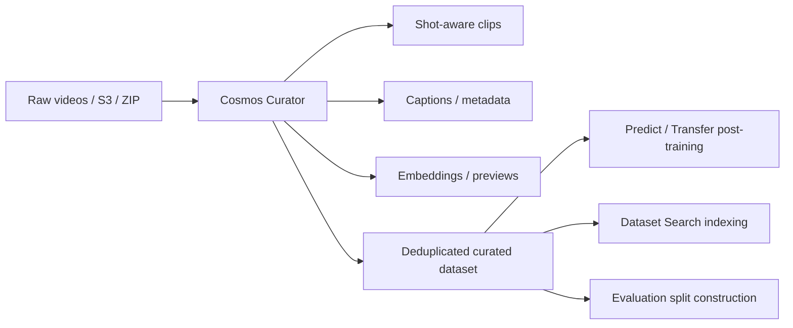

# Cosmos Curator: 视频数据策划与后训练数据工厂

::: info 资料入口
- **服务文档**: [Cosmos Curator on DGX Cloud](https://docs.nvidia.com/cosmos-curator-lha/current/introduction.html)
- **API Reference**: [Cosmos Curator API](https://docs.nvidia.com/cosmos-curator-lha/current/api_reference.html)
- **开源仓库**: [nvidia-cosmos/cosmos-curate](https://github.com/nvidia-cosmos/cosmos-curate)
- **Cookbook**: [Data Curation Overview](https://nvidia-cosmos.github.io/cosmos-cookbook/core_concepts/data_curation/overview.html)
:::

## 核心定位

Cosmos Curator 是 Cosmos 平台中的视频数据策划工具，负责把大规模、长时、异构的视频源转成适合世界模型后训练、检索和评测的数据资产。它不是生成模型，而是 Cosmos 数据闭环的入口：没有稳定的数据切分、筛选、去重、标注和质量控制，Predict/Transfer 的后训练很容易被低质量样本拖垮。

一句话：Curator 解决的是 **训练世界模型之前，如何把原始视频变成可用数据集**。

## 数据流位置



Curator 的输出既可以直接用于 Cosmos-Predict/Transfer 后训练，也可以进入 Dataset Search 建索引，或作为评测集的候选池。

## 主要能力

| 能力 | 作用 | 为什么重要 |
|---|---|---|
| 视频切分 | 将长视频切成语义一致的短片段 | 世界模型训练通常需要稳定、短时、主题明确的 clip |
| 转码与标准化 | 统一格式、帧率、分辨率等 | 减少训练前处理不一致导致的噪声 |
| caption 生成 | 为每段视频生成文本描述 | 支持 Text2World / Video2World 条件训练 |
| embedding 生成 | 为 clip 生成语义向量 | 支持检索、聚类、去重和场景挖掘 |
| preview 生成 | 生成 WebP 等轻量预览 | 方便人工审核和采样检查 |
| 语义去重 | 移除重复或高度相似片段 | 避免模型过拟合同一视觉模式 |
| 数据摘要 | 输出处理统计和元数据 | 方便追踪数据覆盖、失败样本和质量分布 |

## 官方服务使用方式

Cosmos Curator on DGX Cloud 支持两种数据输入方式：

- **AWS S3**：输入 bucket 放原始视频，输出 bucket 接收策划后的数据；
- **ZIP 上传**：把视频数据打包上传，Curator 服务在 NVIDIA DGX Cloud 上处理并保存结果。

也支持两种交互方式：

- **NGC Web UI**：适合人工配置和查看数据处理任务；
- **API**：适合把数据策划接入自动化流水线。

## API 工作流

### 1. 准备权限和数据

API 方式需要：

- NGC API key；
- `curl`、`jq` 等命令行工具；
- ZIP 数据集，或可读写的 S3 bucket；
- 如果走 S3，需要最小权限原则：输入 bucket 只读，输出 bucket 读写。

### 2. 创建 dataset

核心 API 是：

```bash
POST /v1/cosmos/datasets
```

典型 `jobSpec` 会指定 `pipeline: split`，并打开 embedding、preview、caption 等输出：

```json
{
  "name": "my-robot-videos",
  "description": "robot manipulation clips",
  "jobSpec": {
    "pipeline": "split",
    "args": {
      "generate_embeddings": true,
      "generate_previews": true,
      "generate_captions": true,
      "splitting_algorithm": "transnetv2",
      "captioning_prompt_variant": "default"
    }
  }
}
```

### 3. 上传 ZIP 或配置 S3

ZIP 方式通常包含：

1. `POST /upload/initialize` 初始化上传；
2. `POST /upload/getPreSignedUrls` 获取分片上传 URL；
3. 用 presigned URL 上传 ZIP 分片；
4. `POST /upload/finalize` 完成上传；
5. `GET /download/getPreSignedUrls?processed=false` 获取原始数据下载 URL；
6. `POST /process` 启动处理任务。

S3 方式则在创建 dataset 时直接提供：

- `s3InputPrefix`
- `s3OutputPrefix`
- base64 编码后的 `s3Config`
- `jobSpec`

### 4. 获取策划结果

处理完成后，策划后的数据通常包含：

| 目录/文件 | 含义 |
|---|---|
| `clips/` | 切分后的 curated clips |
| `iv2_embd/` | clip embeddings |
| `metas/` | 每个 clip 的 caption 和元数据 |
| `previews/` | WebP 预览 |
| `processed_clip_chunks/` | 已处理 clip 分片记录 |
| `processed_videos/` | 已处理原视频记录 |
| `summary.json` | 处理统计、视频/clip 元数据摘要 |
| `v0/all_window_captions.json` | 聚合后的 caption 文件 |

这些输出可以直接进入后训练脚本，也可以被 Dataset Search 建索引。

## 用于 Cosmos 后训练的建议

- 先定义任务分布，再策划数据：机器人、自动驾驶、仓库监控等场景的过滤标准不同。
- 不要只按视觉质量筛选，还要看动作、相机运动、物体交互和场景覆盖。
- 后训练数据应保留原始视频路径、clip 起止时间、caption、embedding、过滤原因和数据许可信息。
- 对 Video2World，clip 长度要与训练配置匹配；对 Text2World，caption 的语义密度和准确性更重要。
- 去重不能只看文件 hash，应做语义或 embedding 层面的近重复检测。

## 局限

- 自动 caption 可能引入事实错误，关键数据仍需抽样人工审核。
- 语义去重阈值过强会损失长尾，过弱会留下重复样本。
- Curator 不能替代数据许可审查，商业或公开视频仍需检查使用权。
- 高质量策划依赖 GPU 和分布式处理资源；小团队应优先建立轻量抽样与质量检查流程。

## 相关笔记

- [Cosmos 平台总览](cosmos)
- [Cosmos Dataset Search](cosmos-dataset-search)
- [Cosmos-Predict2.5](cosmos-predict2-5)
- [Cosmos-Transfer2.5](cosmos-transfer2-5)
- [Cosmos Evaluator / Guardrail](cosmos-evaluator-guardrail)
