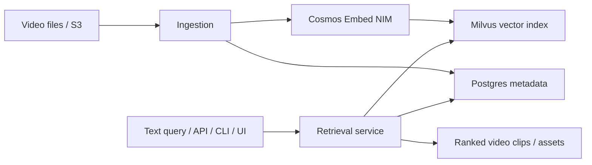

# Cosmos Dataset Search: 面向视频世界数据的语义检索与场景挖掘

::: info 资料入口
- **Documentation**: [Cosmos Dataset Search (CDS)](https://docs.nvidia.com/cosmos/cds/latest/documentation.html)
- **Introduction**: [CDS Introduction](https://docs.nvidia.com/cosmos/cds/latest/introduction.html)
- **User Guide**: [CDS User Guide](https://docs.nvidia.com/cosmos/cds/latest/user-guide.html)
- **CLI Guide**: [CDS CLI User Guide](https://docs.nvidia.com/cosmos/cds/latest/cli-user-guide.html)
:::

## 核心定位

Cosmos Dataset Search（CDS）是一组视频语义检索与分析微服务，用来摄取、索引、搜索和策划多模态数据，重点面向视频理解和时间推理。它在 Cosmos 数据闭环中的作用是：从海量视频里快速找到“需要的世界状态”。

一句话：CDS 解决的是 **有了大规模视频数据后，如何按语义、事件和时间关系找到可训练/可评测的场景**。

## 系统结构

官方架构包含以下核心组件：

| 组件 | 作用 |
|---|---|
| Core Service | 编排 ingest、index、search 请求 |
| Cosmos Embed NIM | 将视频和文本嵌入到统一语义空间 |
| Milvus | 存储 embedding 并执行向量检索 |
| Postgres | 存储 collection 元数据和外部存储信息 |
| UI Service | 提供 Web 检索、浏览和可视化 |



## 部署入口

CDS 文档提供两类部署：

- **Docker Compose**：适合本地开发、测试和评估；
- **AWS EKS**：适合生产级 Kubernetes 部署。

部署完成后，用户可以通过三种方式使用：

- **Web UI**：交互式搜索、浏览、可视化；
- **CLI**：适合 collection 管理、数据摄取和常规搜索；
- **REST API**：适合接入自动化数据流水线或内部平台。

## CLI 使用流程

### 1. 安装与配置

```bash
make install-cds-cli
source .venv/bin/activate
cds --help
```

配置 API endpoint：

```bash
cds config set
```

可为本地和生产环境配置不同 profile：

```bash
cds config set --profile local
cds config set --profile production
cds collections list --profile local
```

### 2. 创建 collection

先查看可用 pipeline：

```bash
cds pipelines list
```

创建一个视频检索 collection：

```bash
cds collections create \
  --pipeline cosmos_video_search_milvus \
  --name "Driving Rainy Night Collection"
```

创建后要记录返回的 `collection.id`，后续 ingest 和 search 都依赖它。

### 3. 摄取视频

CDS 通过 S3-compatible storage 摄取数据。常见配置：

```bash
export AWS_ACCESS_KEY_ID=test
export AWS_SECRET_ACCESS_KEY=test
export AWS_ENDPOINT_URL=http://localhost:4566
export AWS_DEFAULT_REGION=us-east-1
```

摄取视频：

```bash
cds ingest files s3://my-bucket/videos/ \
  --collection-id <COLLECTION_ID> \
  --extensions mp4 \
  --num-workers 3 \
  --limit 100
```

`Status code 200` 表示文件摄取成功。

### 4. 搜索与场景挖掘

搜索可以通过 Web UI、CLI 或 REST API 完成。典型查询不是文件名搜索，而是语义搜索，例如：

- `rainy night intersection with pedestrians`
- `robot arm failed to grasp small object`
- `warehouse worker near forklift`
- `vehicle cutting in from the left lane`

CDS 的价值在于它使用视频-文本统一 embedding，而不是只依赖手写标签或文件夹名。

## 与 Curator 的关系

| 工具 | 输入 | 输出 | 核心问题 |
|---|---|---|---|
| Cosmos Curator | 原始视频 | 切分、caption、embedding、preview、summary | 如何把原始视频变成干净数据集 |
| Cosmos Dataset Search | 已索引视频/metadata | 检索结果、候选场景、collection | 如何从海量数据中找到目标场景 |

实际工作流通常是：

1. Curator 先清洗、切分、caption；
2. CDS 对 curated clips 建索引；
3. 研究者用自然语言查询长尾场景；
4. 查询结果进入后训练或评测集。

## 用于世界模型研究的场景

### 自动驾驶长尾挖掘

用 CDS 搜索事故前兆、罕见天气、非典型路口、夜间低能见度、施工区域等场景，然后用 Cosmos-Predict/Transfer 进行生成式扩展。

### 机器人失败案例采样

搜索抓取失败、碰撞、滑落、遮挡、夹爪未闭合等事件，用于动作条件 Video2World 后训练或策略鲁棒性评测。

### 视频智能体评测集构造

通过自然语言检索特定事件片段，构造视频问答、异常检测、事件定位和物理推理评测集。

## 注意事项

- Query 应包含实体、动作、环境和时间关系，不要只写单个关键词。
- 检索结果需要抽样人工检查，因为 embedding 相似不等于事实完全匹配。
- Collection 应按数据域、采集来源、相机配置和许可边界拆分，避免混用。
- 对自动驾驶和机器人，应保留原始传感器元数据和时间戳，否则检索结果难以和标签/动作对齐。
- GPU_CAGRA 等向量索引配置会影响吞吐和延迟，生产部署要根据数据规模调优。

## 相关笔记

- [Cosmos 平台总览](cosmos)
- [Cosmos Curator](cosmos-curator)
- [Cosmos Evaluator / Guardrail](cosmos-evaluator-guardrail)
- [Cosmos-Predict2.5](cosmos-predict2-5)
- [Cosmos-Drive-Dreams](/world-models/applications/cosmos-drive-dreams)
